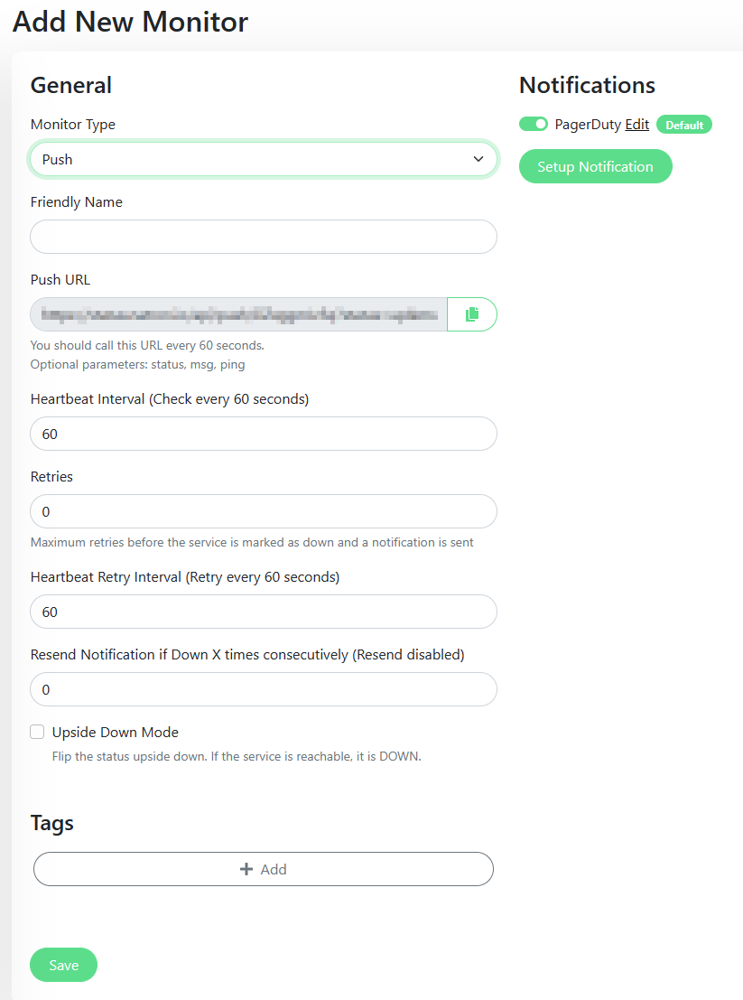

# Alertmanager middleware for Uptime Kuma push monitor

[](https://github.com/natrontech/alertmanager-uptime-kuma-push/blob/main/LICENSE)
[](https://securityscorecards.dev/viewer/?uri=github.com/natrontech/alertmanager-uptime-kuma-push)
[](https://github.com/natrontech/alertmanager-uptime-kuma-push/releases)
[](https://github.com/natrontech/alertmanager-uptime-kuma-push/blob/main/go.mod)
[](https://goreportcard.com/report/github.com/natrontech/alertmanager-uptime-kuma-push)
[](https://slsa.dev)

## What is this?

This binary allows you to use Uptime Kuma as a [Dead Mans Snitch](https://deadmanssnitch.com/) for your Prometheus Alertmanager.
If your Alertmanager stops sending alerts, Uptime Kuma will send you a notification.

## Why does this need an extra middleware?

Alertmanager allows you to configure webhooks to send alerts to.
All webhook alerts from Alertmanager are sent using the HTTP POST method.
Uptime Kuma has a Push Monitor, that listens only for HTTP GET requests.
This middleware listens for POST requests on port 8081 and the `/push` path and forwards them to Uptime Kuma as plain GET requests.

## How to use

Configure this middleware as a sidecar container in your Alertmanager deployment.
Then send alerts to this middleware to forward them to Uptime Kuma.

The binary requires the following environment variables:

| Variable          | Description                                                                    |
| ----------------- | ------------------------------------------------------------------------------ |
| `UPTIME_KUMA_URL` | The URL to your Uptime Kuma instance. This URL should be the push monitor URL. |
| `GET_RETRIES`     | How often a GET request should be retried if it fails. Default is 3.           |

### Example with kube-prometheus-stack
Configure a push monitor in your Uptime Kuma instance.



Add a secret with the Uptime Kuma push URL.

```yaml
apiVersion: v1
kind: Secret
metadata:
    name: uptime-kuma-url
    namespace: monitoring
type: Opaque
stringData:
    # Required
    UPTIME_KUMA_URL: "https://uptime-kuma.example.com/api/push/XXXXXXX"
    # Optional
    GET_RETRIES: 3
```

Add this middleware as a sidecar container to your Alertmanager deployment.
Use the secret as an environment variable.

```yaml
alertmanager:
    alertmanagerSpec:
    # Sidecar middleware to push watchdog alerts to uptime-kuma
        containers:
        - name: alertmanager-uptime-kuma-push
            image: ghcr.io/natrontech/alertmanager-uptime-kuma-push:latest
            ports:
            - containerPort: 8081
            envFrom:
            - secretRef:
                name: uptime-kuma-url
```

Add a new receiver for the Watchdog alert to your Alertmanager configuration.
We don't send resolved because the Watchdog alert is always firing.

```yaml
route:
    routes:
        - receiver: Dead Mans Snitch Uptime Kuma
          matchers:
            - alertname =~ "InfoInhibitor|Watchdog"
          group_wait: 0s
          group_interval: 50s
          repeat_interval: 1m
receivers:
    - name: Dead Mans Snitch Uptime Kuma
      webhook_configs:
        - url: http://localhost:8081/push
          send_resolved: false
```

## Release

Each release of the application includes Go-binary archives, checksums file, SBOMs and container images. 

The release workflow creates provenance for its builds using the [SLSA standard](https://slsa.dev), which conforms to the [Level 3 specification](https://slsa.dev/spec/v1.0/levels#build-l3). Each artifact can be verified using the `slsa-verifier` or `cosign` tool (see [Release verification](SECURITY.md#release-verification)).
